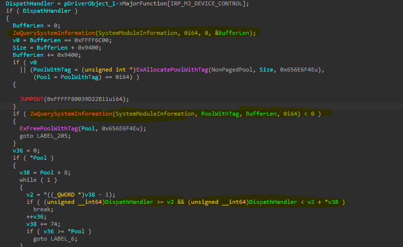

# Warzone-HWID-Spoofer

A hardware ID (HWID) spoofer for Call of Duty Warzone, created to bypass the anti-cheat checks. After reversing Randgrid.sys, I found that the driver and user-mode components query multiple hardware identifiers, including:

- NIC MAC Addresses

- Disk Serials

- Volume GUIDs

- Volume Serials

- USB Serials

- SMBIOS Information

- Partition IDs

## Evidence (IOCTL Hooks):
```
1. \??\PhysicalDrive0 : IOCTL_CODE: 0x21009A
2. \??\Nsi : IOCTL_CODE: 0x12001B (IOCTL_NSI_GETALLPARAM)
3. \??\Nsi : IOCTL_CODE: 0x120007 (IOCTL_NSI_GETPARAM)
4. \??\hid#acpi0011#*REDACTED*#{*REDACTED*} : IOCTL_CODE: 0xB01A8 (IOCTL_HID_GET_COLLECTION_INFORMATION)
5. \??\MountPointManager : IOCTL_CODE: 0x6D0030	(IOCTL_MOUNTMGR_QUERY_DOS_VOLUME_PATH)
```


## What Does This Spoof?
**<ins>Network Identifiers:</ins>**

- **ARP Table:** Spoofs the ARP table to prevent tracking MAC addresses of devices on your network. This method is super invasive, likely querying the router’s MAC address.
  
- **MAC Addresses:** The user-mode anti-cheat calls ```GetAdaptersInfo```, which goes into multiple IOCTL calls in driver space to retrieve network adapter details. We spoof this by hooking NSI and waiting for a ```Params->Type NSI_GET_IP_NET_TABLE```
  
**<ins>Storage Identifiers:</ins>**

- **Partition GUID:** Spoofs all partition GUIDs for every drive in the system.
  
- **Volume GUID:** Ensures all volume GUIDs are randomized across disk volumes.
  
- **Volume Serial:** Randgrid.sys logs volume serials via ```GetVolumeInformationA```, which is unreliable as Windows generates a six-digit number per volume. This spoofer replaces these serials with randomized values.
  
- **USB Serial:** The anti-cheat retrieves USB serial numbers through HIDUSB.sys. Since not all USB devices have serials, nulling this information is fine and shouldn't raise any flags.

**<ins>System Identifiers:</ins>**

- **SMBIOS:** Modifies system information, including baseboard details, processor information, and chassis data.

- **Disk:** Handles various IOCTL calls that retrieve disk information, including:
```IOCTL_ATA_PASS_THROUGH_DIRECT, IOCTL_ATA_PASS_THROUGH, IOCTL_STORAGE_QUERY_PROPERTY, SMART_RCV_DRIVE_DATA, IOCTL_SCSI_PASS_THROUGH, IOCTL_SCSI_MINIPORT, IOCTL_DISK_GET_DRIVE_GEOMETRY, etc.```


## What Does This Bypass?


Randgrid.sys verifies IOCTL dispatch routines and checks whether the routine executes within the expected module. This is bypassed by:

1. Scanning for the discardable section in a driver.

2. Allocating a pool with a JMP instruction pointing to the real dispatch handler location.

3. Changing the PTE of the discardable section to the PTE of the allocated pool which holds the JMP buffer.
```
ReferenceObjByName-> \Driver\disk	
ReferenceObjByName-> \Driver\mountmgr
```

This spoofer is not like most P2Cs in the cheating scene, the spoofer mixes your current serial number and shuffles it based on the drivers start time (seed). Most of the spoofers in the cheat scene for Call of Duty will only change the last 4 letters/numbers on the HWID or completly nulling each serial which is a huge red flag.


## Credits
[SkLib](https://github.com/cutecatsandvirtualmachines/SKLib) - This was an awesome reference learning HWID spoofing, and highly recommend you give this a read.


